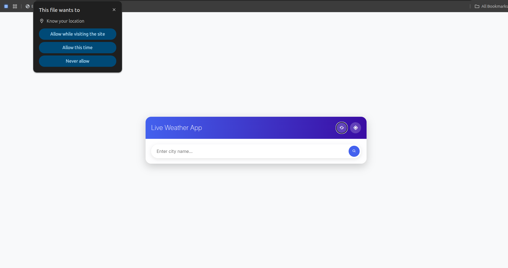
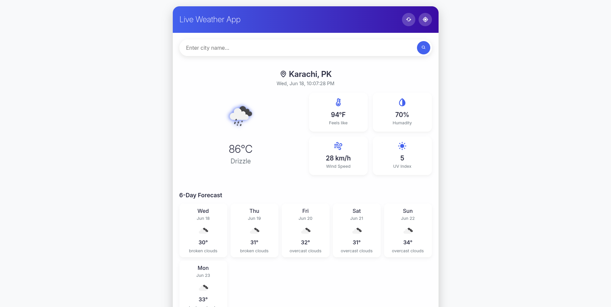

# 🌦️ Live Weather App

A simple **live weather application** built using **HTML**, **CSS**, and **JavaScript**, powered by the **OpenWeatherMap API**.

## 🌐 Features

- Search weather by **city name**
- Get **real-time temperature**, weather status, humidity, wind, and more
- Clean, responsive UI
- Uses **OpenWeatherMap** API for accurate weather data

## 🧪 Technologies Used

- HTML5
- CSS3
- JavaScript (Vanilla)
- [OpenWeatherMap API](https://openweathermap.org/api)

## 🎨 UI Preview





## ⚙️ How to Use

1. Clone the repository:

```bash
git clone https://github.com/codewith-ibrahim/live-weather.git
